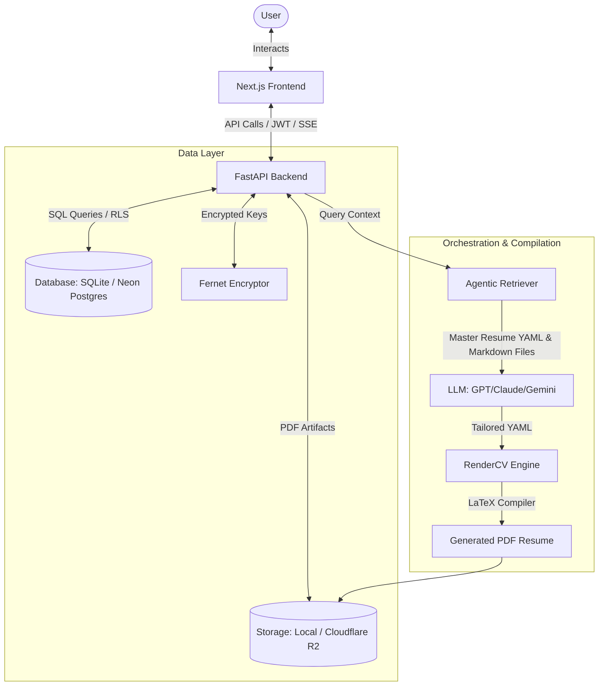

# ResuMate Career OS

> **The Intelligent, Agentic Career Operating System**

ResuMate is a modern career platform designed to automate, track, and optimize the entire job application lifecycle. Rather than relying on generic resume rewriting, ResuMate employs an agentic LLM architecture that dynamically cross-references a user's master resume data with their detailed, private career logs to generate tailored, factual, and impact-driven resumes. Output is compiled in real-time into publication-quality, ATS-friendly PDFs using RenderCV.

## Product Highlights

*   **Agentic Resume Tailoring**: A context-aware agent scans your personal project journals, work experience diaries, and detailed skill descriptions to construct truthful, contextually relevant bullet points tailored specifically to the target job description.
*   **Compile-Ready PDF Engine**: Integrated with `RenderCV` to compile YAML resume data directly into professionally formatted LaTeX-rendered PDFs, avoiding the visual inconsistencies of traditional HTML-to-PDF generators.
*   **Unified Application Pipeline**: Track application progress, manage interview histories, store target job credentials, and store multiple tailored resume versions inside a single central dashboard.
*   **Contextual Interview Simulator**: An interactive prep tool that analyzes both the job description and your tailored resume to simulate technical and behavioral interviews, matching the exact profile of the company.
*   **Encrypted Secrets Vault**: User-provided API keys (OpenAI, Gemini, OpenRouter) are encrypted at rest using server-side Fernet symmetric encryption.
*   **Dual-Mode Deployment**: Supports lightweight local runtimes via Docker Compose (SQLite and local file storage) as well as cloud-native production hosting (Neon Serverless Postgres, Cloudflare R2 object storage, Render, and Vercel).

## Architecture Overview



## Technology Stack

### Frontend
*   **Next.js 16 (App Router) & TypeScript**: Modular, responsive layout optimized for user experience.
*   **Tailwind CSS 4 & tw-animate-css**: Fluid design system utilizing rich dark modes, glassmorphism, and micro-interactions.
*   **Radix UI & Lucide React**: Accessible, unstyled primitives for UI components paired with consistent iconography.
*   **Axios with CSRF & HttpOnly Cookie Auth**: Secure API integrations with cross-origin cookie-based state.

### Backend
*   **FastAPI & Python 3.10+**: High-performance, asynchronous REST API structure.
*   **SQLAlchemy ORM & Alembic Migrations**: Structured data mapping supporting Postgres and SQLite targets.
*   **RenderCV Integration**: Professional YAML-to-PDF compiler.
*   **Cryptography (Fernet)**: Symmetric encryption for encrypting sensitive user credentials at rest.
*   **Postgres Row-Level Security (RLS)**: Fine-grained security policy layer enforcing data isolation between accounts.

## Getting Started

### Local Setup via Docker Compose (Quickest)

1.  Clone the repository and enter the directory:
    ```bash
    git clone https://github.com/yakuraku/resumate.git
    cd ResuMate
    ```
2.  Configure environment variables:
    ```bash
    cp backend/.env.example backend/.env
    ```
    Open `backend/.env` and insert your preferred LLM API keys (e.g., `OPENAI_API_KEY`, `OPENROUTER_API_KEY`, or `GEMINI_API_KEY`).
3.  Add your master resume:
    ```bash
    cp master-resume_CV.yaml.example master-resume_CV.yaml
    ```
    Update `master-resume_CV.yaml` with your personal details, project details, and experience history.
4.  Launch the environment:
    ```bash
    docker compose up --build
    ```
    Once initialized, access the portal at `http://localhost:1235`. Complete configuration via the **Settings** page.

### Cloud SaaS Infrastructure (Production)

ResuMate is designed to scale to multiple users in a cloud-hosted environment:
*   **Database**: Neon Serverless Postgres in a pooled setup to handle high concurrent client sessions.
*   **Object Storage**: Cloudflare R2 bucket for low-latency, egress-free PDF storage.
*   **Backend Hosting**: Render (Web Service) running the FastAPI container and executing RenderCV PDF compilation.
*   **Frontend Hosting**: Vercel (Next.js client deployment).
*   **Security & Multi-Tenancy**: Postgres Row-Level Security (RLS) ensures that all queries are scoped strictly to the authenticated user ID.

## Project Structure

```bash
ResuMate/
├── backend/                # FastAPI Backend
│   ├── app/                # Application source code
│   ├── alembic/            # Database migrations
│   ├── data/               # SQLite database storage
│   └── tests/              # Pytest suite
├── frontend/               # Next.js Frontend
│   ├── src/                # Source code (app, components, lib)
│   ├── public/             # Static assets
│   └── e2e/                # Playwright end-to-end tests
├── my_info/                # USER CONTEXT: Markdown files with your career history
├── master-resume_CV.yaml   # SOURCE OF TRUTH: Your master resume data
└── resume-tailor-helper.md # Prompt engineering context for the AI
```

## License
Proprietary - Internal Use Only.
